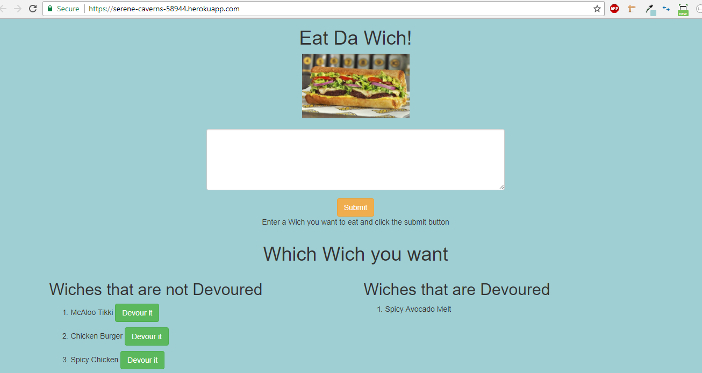
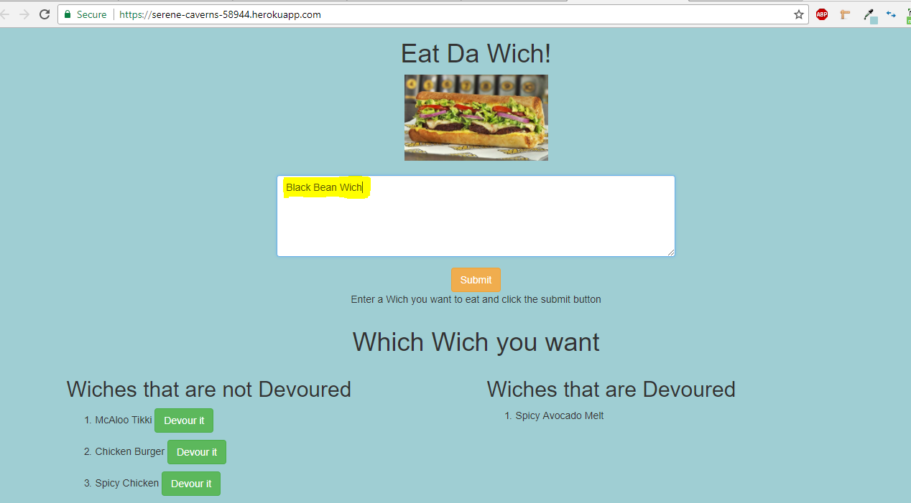
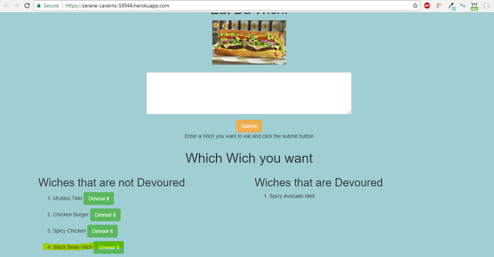
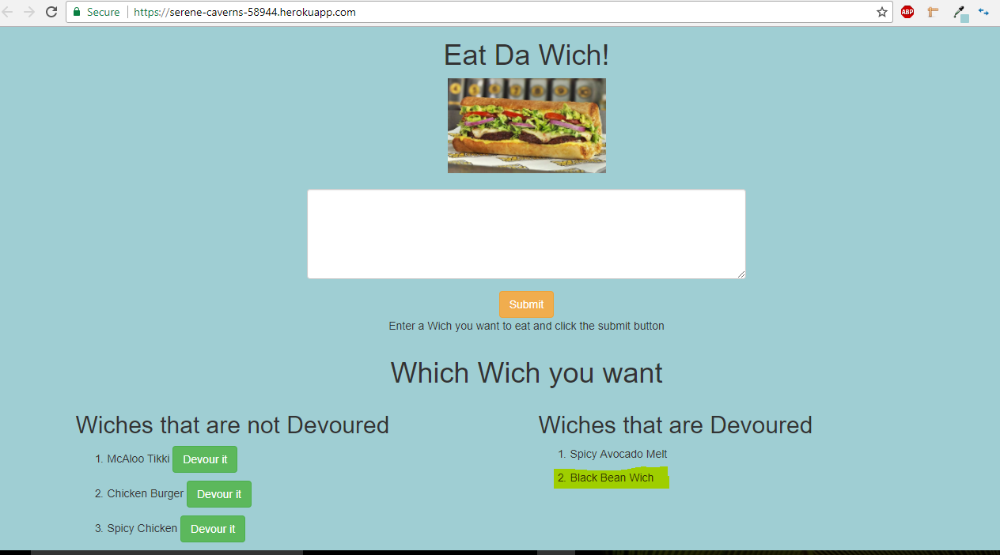

# Eat the Wich!
Eat-Da-Wich! is a restaurant app that lets users input the names of wiches they'd like to eat.
Whenever a user submits a wich's name, your app will display the wich on the left side of the page -- waiting to be devoured.
Each wich in the waiting area also has a Devour it! button. When the user clicks it, the wich will move to the right side of the page.

The app stores this backend data in a MySQL DB to keep track of whether the wich is devoured or not.

# Functionality
* Landing Page 
	

* Submitting a new Wich
	 

* Listing of wiches to be devoured
	 

* Wiches Devoured after clicking on "Devour It " button
	 

# Technology Stack using MVC structure

	* Front End: html, css, jQuery
 	* Backend: nodeJS, expressJS, javascript, handlebars

# Link to the app on heroku
https://serene-caverns-58944.herokuapp.com/
